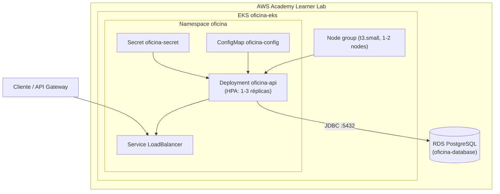

# oficina-kubernetes

Infraestrutura como código (Terraform) do cluster Kubernetes e manifests de deploy da oficina —
Terceiro Tech Challenge da Pós-Tech em Arquitetura de Software (FIAP).

## Propósito

Provisionar o cluster **Amazon EKS** que executa a [API principal (`oficina`)](https://github.com/rremiao/oficina)
e versionar os manifests Kubernetes do workload (namespace, configuração, deployment, service e
autoscaling). Este repositório é dono da infraestrutura de execução — a imagem Docker da aplicação
continua sendo construída e publicada pelo pipeline do repositório `oficina`.

## Tecnologias

- Terraform (~> 1.5)
- AWS Provider (~> 5.0)
- Amazon EKS + node group gerenciado
- Kubernetes (Deployment, Service LoadBalancer, ConfigMap, Secret, HPA)
- New Relic (Infrastructure agent + APM auto-injetado + `nri-postgresql`) — monitoramento e observabilidade
- GitHub Actions (validação de Terraform e dos manifests)

## Pré-requisitos

- Terraform >= 1.5.0
- `kubectl`, `aws-cli` e `helm` configurados
- Credenciais AWS (AWS Academy/Learner Lab: `aws configure` com as credenciais temporárias da sessão)
- Conta New Relic (free tier) e a respectiva license key, para a etapa de observabilidade

## Estrutura

```text
.
|-- infra/
|   |-- main.tf                        # cluster EKS + node group + tagging de subnets
|   |-- variables.tf
|   |-- outputs.tf
|   |-- providers.tf
|   |-- versions.tf
|   `-- terraform.tfvars.example
|-- k8s/
|   |-- 00-namespace.yaml
|   |-- 01-configmap.yaml.tpl          # placeholder __RDS_ENDPOINT__, preenchido no deploy
|   |-- 02-secret.yaml
|   |-- 03-app-deployment.yaml
|   |-- 04-app-service-loadbalancer.yaml
|   |-- 05-hpa.yaml
|   |-- 06-newrelic-instrumentation.yaml  # CR que aciona a auto-injeção do APM Java
|   `-- 07-newrelic-postgresql.yaml       # Deployment + ConfigMap do monitoramento do RDS
|-- observability/
|   |-- newrelic-values.yaml               # values do chart newrelic/nri-bundle
|   |-- newrelic-secret.example.yaml       # template do Secret com a license key (nunca commitar preenchido)
|   |-- nri-postgresql-secret.example.yaml # template do Secret com a senha do usuário de monitoramento
|   `-- postgres-integration.md            # passo a passo completo do nri-postgresql pro RDS
|-- docs/
|   |-- rfc/0001-escolha-do-cluster-kubernetes.md
|   |-- adr/0001-estrategia-de-escalabilidade-hpa.md
|   |-- adr/0002-escolha-da-ferramenta-de-observabilidade.md
|   `-- adr/0003-licoes-da-primeira-implantacao-real.md
`-- .github/workflows/infra-kubernetes.yml
```

## Arquitetura



O `Service` do tipo `LoadBalancer` expõe a API publicamente via ELB da AWS; o `ConfigMap` injeta o
endpoint do RDS (repositório `oficina-database`) e o `Secret` injeta as credenciais de banco e a
chave JWT. O HPA ajusta a quantidade de réplicas do `Deployment` conforme a utilização de CPU.

## Execução e deploy

### 0. Bootstrap do bucket de state (uma vez só, por conta AWS)

O backend `s3` é parcial de propósito (`backend "s3" {}` em `versions.tf`) — o bucket não é
provisionado pelo próprio Terraform deste repositório. Criar manualmente antes do primeiro `init`:

```bash
BUCKET="oficina-kubernetes-tfstate-$(aws sts get-caller-identity --query Account --output text)"
aws s3api create-bucket --bucket "$BUCKET" --region us-east-1
aws s3api put-bucket-versioning --bucket "$BUCKET" --versioning-configuration Status=Enabled
aws s3api put-public-access-block --bucket "$BUCKET" \
  --public-access-block-configuration BlockPublicAcls=true,IgnorePublicAcls=true,BlockPublicPolicy=true,RestrictPublicBuckets=true
```

No AWS Academy Learner Lab, a conta é reciclada periodicamente — se o bucket sumir, este passo
precisa ser refeito antes de qualquer `terraform init`.

### 1. Provisionar o cluster

```bash
cd infra
cp terraform.tfvars.example terraform.tfvars
# edite terraform.tfvars conforme necessário

terraform init \
  -backend-config="bucket=<bucket-do-bootstrap-acima>" \
  -backend-config="key=oficina-kubernetes/terraform.tfstate" \
  -backend-config="region=us-east-1"

terraform plan -out=tfplan
terraform apply tfplan
```

### 2. Configurar o `kubectl`

```bash
aws eks update-kubeconfig --region us-east-1 --name oficina-eks
kubectl get nodes
```

### 3. Aplicar os manifests

O `01-configmap.yaml.tpl` tem um placeholder `__RDS_ENDPOINT__` que precisa ser substituído pelo
`rds_endpoint` (output do repositório [`oficina-database`](https://github.com/rremiao/oficina-database))
antes do apply:

```bash
sed "s/__RDS_ENDPOINT__/$(terraform -chdir=../oficina-database/infra output -raw rds_endpoint)/" \
  k8s/01-configmap.yaml.tpl > k8s/01-configmap.yaml

kubectl apply -f k8s/00-namespace.yaml
kubectl apply -f k8s/01-configmap.yaml
kubectl apply -f k8s/02-secret.yaml
kubectl apply -f k8s/03-app-deployment.yaml
kubectl apply -f k8s/04-app-service-loadbalancer.yaml
kubectl apply -f k8s/05-hpa.yaml

kubectl -n oficina get pods,svc,hpa
```

### 4. Instalar o monitoramento (New Relic)

> Validado numa implantação real ponta a ponta — os ajustes descobertos nesse processo (alguns não
> óbvios pela documentação oficial) estão registrados no
> [ADR-0003](docs/adr/0003-licoes-da-primeira-implantacao-real.md). Vale ler antes de reproduzir.

```bash
helm repo add newrelic https://helm-charts.newrelic.com
helm repo update

# Secret com a license key, nos dois namespaces exigidos (newrelic e oficina) — ver
# observability/newrelic-secret.example.yaml. O Secret do namespace `oficina` precisa das DUAS
# chaves (licenseKey e new_relic_license_key) — são convenções diferentes dentro do mesmo bundle.
cp observability/newrelic-secret.example.yaml observability/newrelic-secret.yaml
# edite observability/newrelic-secret.yaml com a license key real (arquivo ignorado pelo git)

kubectl create namespace newrelic --dry-run=client -o yaml | kubectl apply -f -
kubectl create namespace oficina --dry-run=client -o yaml | kubectl apply -f -
kubectl apply -f observability/newrelic-secret.yaml

helm upgrade --install newrelic-bundle newrelic/nri-bundle \
  -n newrelic \
  -f observability/newrelic-values.yaml \
  --timeout 5m
```

> Se o `helm install` travar esperando o pod `nri-metadata-injection-admission-patch` (mensagem
> `Too many pods` no `kubectl get pods -n newrelic`), o node group está saturado — `t3.small` suporta
> poucos pods por instância. O `terraform.tfvars.example` já usa `node_desired_size = 2` por causa
> disso (ver ADR-0003, item 1).

```bash
kubectl apply -f k8s/06-newrelic-instrumentation.yaml
kubectl -n oficina rollout restart deployment oficina-api  # reaplica o Pod com a instrumentação
```

O APM agent Java é injetado automaticamente no `oficina-api` pelo `k8s-agents-operator` — nenhuma
alteração é necessária no `Dockerfile` ou no `pom.xml` do repositório `oficina`.

### 5. Monitoramento do RDS (nri-postgresql)

Componente separado do bundle principal — ver
[`observability/postgres-integration.md`](observability/postgres-integration.md) para o passo a passo
completo (criação do usuário de monitoramento no banco, Secret da senha e aplicação de
[`k8s/07-newrelic-postgresql.yaml`](k8s/07-newrelic-postgresql.yaml)).

### 6. Dashboards, alerta de negócio e Synthetic Monitor

Configurados direto na UI do New Relic (não via Terraform/Helm) — passo a passo completo, incluindo
as 3 queries NRQL dos dashboards, a condição de alerta e a configuração do Synthetic Monitor, em
[ADR-0004](docs/adr/0004-dashboards-alertas-e-synthetic-monitor.md).

### Destruir o ambiente ao final do Lab

```bash
kubectl delete -f k8s/04-app-service-loadbalancer.yaml   # remove o ELB antes do destroy
terraform -chdir=infra destroy
```

> Isso derruba só o que está **neste** repositório (EKS + app). O ambiente completo envolve mais
> dois `terraform destroy` (Lambda e RDS), numa ordem específica — ver o
> [runbook do ambiente completo](docs/runbook-ambiente-completo.md), que cobre subir e derrubar os
> 4 repositórios juntos, na ordem certa, e o que precisa ser refeito a cada novo ciclo de sessão do
> AWS Academy Learner Lab (que dura 4 horas).

## Pipeline (CI/CD)

O workflow [`infra-kubernetes.yml`](.github/workflows/infra-kubernetes.yml) tem três jobs:

- **`validate-terraform`** (push e PR): `fmt -check`, `init -backend=false`, `validate`.
- **`validate-manifests`** (push e PR): valida o schema de cada YAML com `kubeconform`.
- **`deploy`** (só push na `main`, ou disparo manual): aplica o Terraform de verdade
  (`terraform apply -auto-approve`), provisionando o cluster EKS, usando o state remoto no bucket S3
  do bootstrap acima.

O `deploy` cobre só o Terraform (o cluster em si) — o `kubectl apply` dos manifests e a instalação do
New Relic (Helm) continuam manuais, porque dependem do cluster já estar de pé e de segredos (license
key, senha do banco) que não fazem sentido guardar como GitHub Secret de uma pipeline que não os usa
diretamente. Passo a passo completo no [runbook](docs/runbook-ambiente-completo.md).

O `deploy` depende de credenciais AWS válidas configuradas como **Secrets** do repositório
(Settings → Secrets and variables → Actions):

| Nome | Tipo | Conteúdo |
|---|---|---|
| `AWS_ACCESS_KEY_ID` | Secret | Credencial temporária da sessão AWS Academy |
| `AWS_SECRET_ACCESS_KEY` | Secret | Credencial temporária da sessão AWS Academy |
| `AWS_SESSION_TOKEN` | Secret | Credencial temporária da sessão AWS Academy |
| `TF_STATE_BUCKET` | Variable | Nome do bucket criado no bootstrap acima |

**Importante**: como o Learner Lab usa credenciais de sessão (expiram em poucas horas, mudam a cada
"Start Lab"), os 3 secrets de AWS precisam ser **atualizados manualmente antes de cada push que deva
disparar um deploy real** — a pipeline falha com uma mensagem clara (`Credenciais AWS invalidas ou
expiradas`) se estiverem vencidas, em vez de tentar aplicar com credencial inválida.

## Decisões arquiteturais

- [RFC-0001 — Escolha do cluster Kubernetes gerenciado](docs/rfc/0001-escolha-do-cluster-kubernetes.md)
- [ADR-0001 — Estratégia de escalabilidade via HPA](docs/adr/0001-estrategia-de-escalabilidade-hpa.md)
- [ADR-0002 — Escolha da ferramenta de observabilidade](docs/adr/0002-escolha-da-ferramenta-de-observabilidade.md)
- [ADR-0003 — Ajustes descobertos na primeira implantação real](docs/adr/0003-licoes-da-primeira-implantacao-real.md)
- [ADR-0004 — Dashboards, alerta de negócio e Synthetic Monitor](docs/adr/0004-dashboards-alertas-e-synthetic-monitor.md)
- [ADR-0005 — Deploy automático do Terraform via pipeline, com state remoto](docs/adr/0005-deploy-automatico-via-pipeline.md)

## Swagger / Postman

Não aplicável — este repositório não expõe API própria. A documentação OpenAPI e a collection
Postman da aplicação executada neste cluster estão no repositório
[`oficina`](https://github.com/rremiao/oficina).
